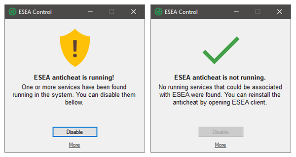

# ESEA Control
ESEA client does not have an option to temporarily disable its anti-cheat solution and that can be a big issue for anyone that cares about their privacy (and are somehow using Windows as primary OS) or for anyone that wants to experiment with kernel-mode development and generally mess with the system. This simple program allows you to disable autostart of all ESEA related services included boot-time anti-cheat driver. **You will not be able to play while the anti-cheat is disabled and you will need to reinstall it in ESEA client to play again.**

  

## Download
To download the latest compiled release, use [GitHub releases](https://github.com/SamuelTulach/esea-control/releases/) (what a surprise).